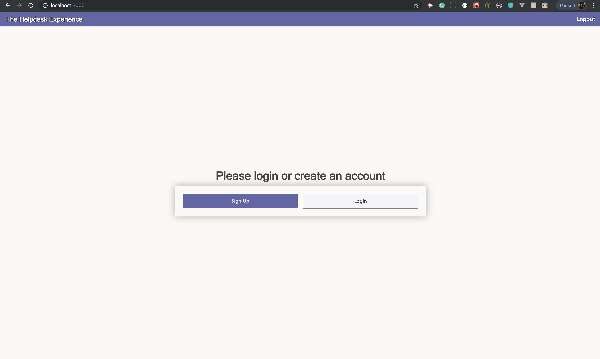
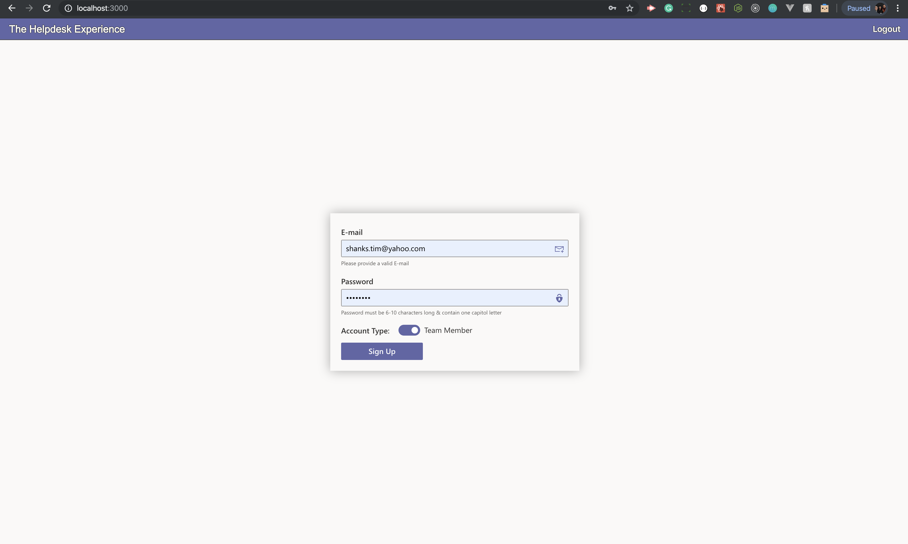
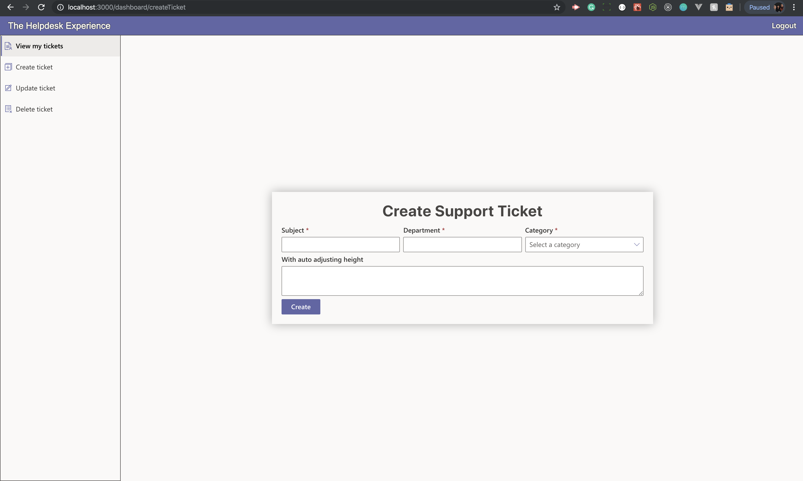
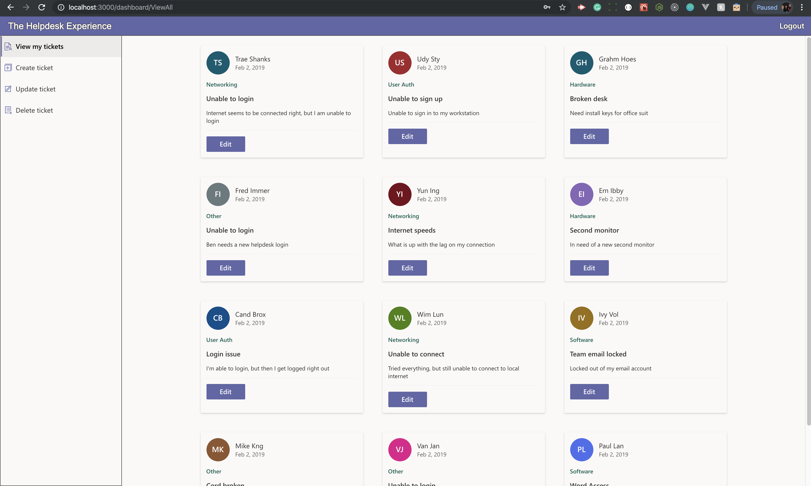
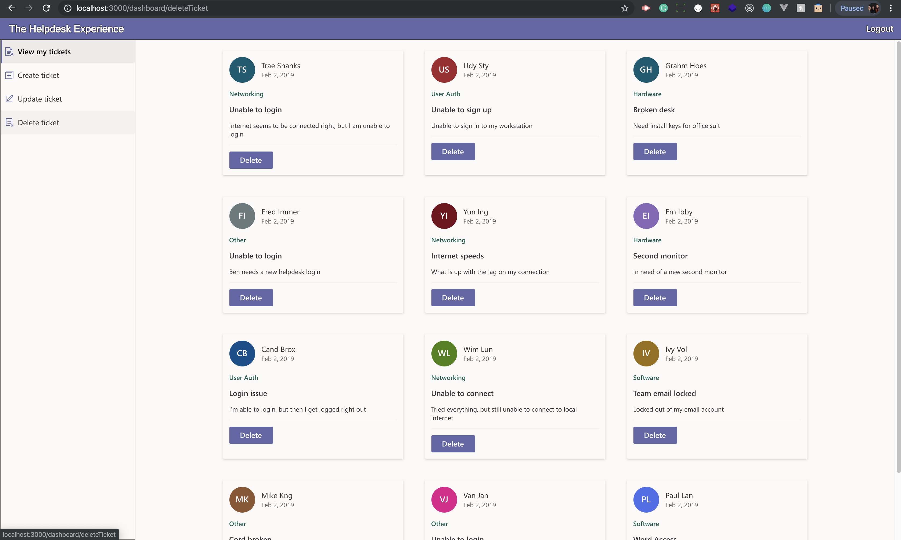

# The Helpdesk Experience

A support ticketing web app — submit requests, track their status, and manage the whole queue.

**The short story:** this app was originally built in October 2019 as a take-home project for a
Microsoft interview (React 16 + Office UI Fabric v7 on the front end, C#/ASP.NET + SQL Server +
Docker on the back end — the original code is preserved in this repo's git history). In 2026 it was
rebuilt on the modern version of that same stack. Same app, same flows, seven years of tooling
later.

## Stack — then and now

| 2019 | 2026 |
| --- | --- |
| create-react-app | Vite |
| React 16 | React 19 |
| TypeScript 3.6 | TypeScript 5 |
| Office UI Fabric v7 | Fluent UI v9 (`@fluentui/react-components`) |
| React Router v5 | React Router v8 |
| C# / ASP.NET + MSSQL | In-browser demo store (localStorage) |

The backend was replaced with a client-side data layer that mimics the original API: async CRUD
with realistic latency, seeded demo tickets on first visit, and persistence in your browser's
local storage. Every visitor gets their own private, durable copy of the data — nothing is sent
to a server, and passwords are never stored.

## Features

- Sign in / create an account (demo auth — any credentials work), or use the one-click
  **Demo as User** / **Demo as Team** entries
- Role-based views: Helpdesk Users see and edit their own tickets; Team Members see the full
  queue, change statuses, and delete tickets
- Create and edit tickets in a side drawer with validation
- Search, category, and status filters with live counts
- Light/dark theme, loading skeletons, empty states, toasts, and motion
- Reset demo data from the account menu at any time

## Running it

```bash
npm install
npm run dev      # local dev server
npm run build    # production build (set HELPDESK_BASE=/some/path/ to host under a subpath)
```

## The 2019 original

Screenshots of the original take-home submission:

### Main page

### Sign up

### Create ticket

### View / edit tickets

### Team member delete view


Original back-end repo: https://github.com/shankstee/helpDeskAPI
